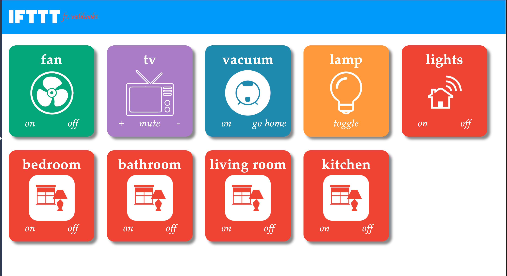

# introducing... IFTTT ft. webhooks!!!

## Ever wanted to control your smart devices all from one place on your browser? Use this interface to connect to IFTTT via their Webhooks service to connect directly to all your favorite IFTTT-connected smart devices!

### Just follow these simple steps:
* connect your smart devices to Webhooks events on IFTTT following the directions best explained [here](https://www.macstories.net/ios/how-to-trigger-ifttt-applets-with-ios-12s-new-shortcuts-app-and-siri/)
* fork this project locally
* replace my provided example metadata with the events you created in src/assets/json/devices.json in the format specified in src/app/shared/models/device.model.ts.
You can leave the 'img' and 'company' fields blank if you want. I borrowed most of my icons from the [IFTTT site](https://ifttt.com) itself
* create a config.ts file in src/config in format specified in src/config/config.dist.ts with your unique Webhooks key
* enjoy!

-- --

This project was generated with [Angular CLI](https://github.com/angular/angular-cli) version 10.0.4.

## Development server

Run `ng serve` for a dev server. Navigate to `http://localhost:4200/`. The app will automatically reload if you change any of the source files.

## Code scaffolding

Run `ng generate component component-name` to generate a new component. You can also use `ng generate directive|pipe|service|class|guard|interface|enum|module`.

## Build

Run `ng build` to build the project. The build artifacts will be stored in the `dist/` directory. Use the `--prod` flag for a production build.

## Running unit tests

Run `ng test` to execute the unit tests via [Karma](https://karma-runner.github.io).

## Running end-to-end tests

Run `ng e2e` to execute the end-to-end tests via [Protractor](http://www.protractortest.org/).

## Further help

To get more help on the Angular CLI use `ng help` or go check out the [Angular CLI README](https://github.com/angular/angular-cli/blob/master/README.md).
